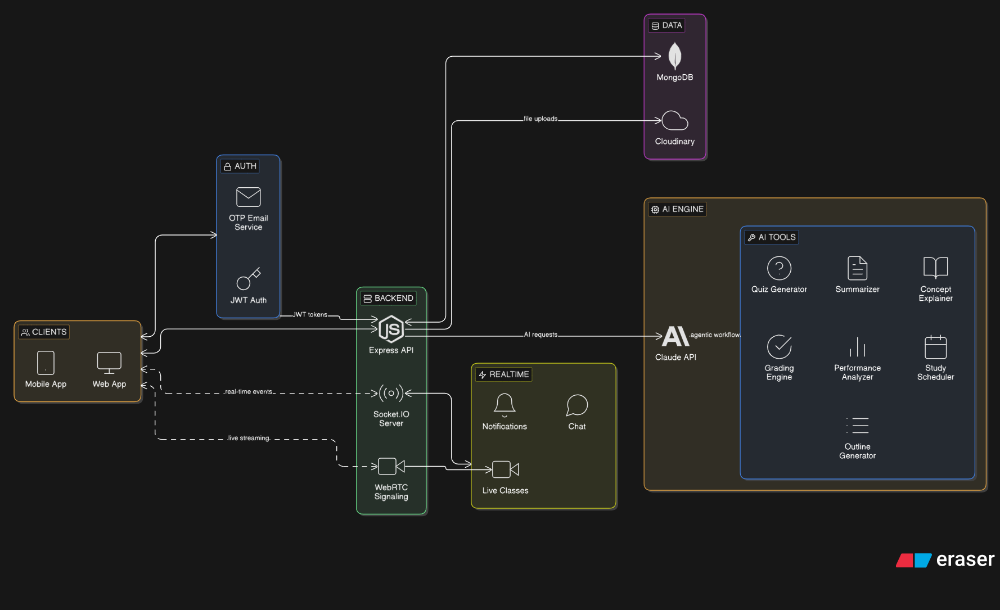

# SmartClass

An AI-powered Learning Management System built for teachers and students. SmartClass brings together real-time live classes, course management, AI-assisted learning tools, and automated grading into a single unified platform.

---

## System Architecture



SmartClass follows a client-server architecture with four principal layers:

**Clients** — A React-based web application and a mobile-compatible interface connect to the backend over HTTPS and WebSocket. All communication goes through JWT-authenticated HTTP-only cookies.

**Backend** — A Node.js Express API acts as the central hub. It handles all business logic, coordinates between the database, real-time services, file storage, and the AI engine. Socket.IO runs on the same HTTP server for real-time event delivery.

**Realtime Layer** — Socket.IO powers instant notifications and in-class chat. WebRTC signaling, also brokered through Socket.IO, establishes peer-to-peer media streams between the teacher (broadcaster) and all students (viewers) during live classes.

**AI Engine** — The Anthropic Claude API is called through an agentic workflow layer. Each AI feature (quiz generation, summarization, concept explanation, grading, study planning, performance analysis, course outline generation) is a discrete tool. A multi-step agent chains these tools together for complex requests.

**Data Layer** — MongoDB stores all application data. Cloudinary handles file uploads (course materials, assignment attachments, class recordings).

---

## Tech Stack

| Layer | Technology |
|---|---|
| Frontend | React 19, Vite, Tailwind CSS 4, React Router 7 |
| Backend | Node.js, Express 5 |
| Realtime | Socket.IO 4 |
| Database | MongoDB with Mongoose |
| Authentication | JWT (HTTP-only cookies), bcrypt, Google OAuth 2.0 |
| AI | Anthropic Claude API (`@anthropic-ai/sdk`) |
| File Storage | Cloudinary, Multer |
| Email | Nodemailer (Gmail App Password) |
| Charts | Recharts |
| Testing | Vitest, Supertest, mongodb-memory-server |

---

## Features

### Authentication

SmartClass uses a two-step email verification flow. When a user registers, a one-time password (OTP) is sent to their email address via Nodemailer. Only after entering the correct OTP does the account become active. On subsequent logins, a signed JWT is issued and stored in an HTTP-only cookie, making it inaccessible to client-side JavaScript and resistant to XSS attacks. Google OAuth is also supported as an alternative sign-in method — users who authenticate via Google skip the OTP step entirely. Roles are assigned at registration: a user is either a `teacher` or a `student`, and role-based access control is enforced on every protected API route.

### Course Management

Teachers create courses with a title, description, subject, and optional cover image. Once created, the teacher can add structured course materials — documents, PDFs, images, or links — which are stored on Cloudinary and served back via signed URLs. Teachers can update or delete their own courses at any time. Students browse the course catalogue, view course details and enrolled counts, and send an enrollment request. Enrollment state is tracked per student per course, and teachers can approve or decline requests. Completed materials are tracked individually so students can resume where they left off.

### Assignments

Teachers create assignments within a course with a title, description, due date, maximum score, and an optional file attachment (rubric, starter code, reference document). Students submit their work as text content and can attach a file. Each submission is timestamped and linked back to the student and assignment. Once graded, a score and optional feedback text are stored on the submission. The teacher dashboard surfaces pending (ungraded) submissions so nothing falls through the cracks.

### Quizzes

Teachers create quizzes inside a course. Each question is multiple-choice with one correct option and per-question point values. A time limit and optional due date can be set. When a student attempts a quiz, answers are recorded, scored immediately, and stored as a `QuizResult`. The result includes per-question correctness, the total score, and a percentage. Quiz history is available on the student dashboard. Teachers can also generate quizzes using the AI Quiz Generator (described below) and publish them directly to the course.

### Live Classes

Live classes are the real-time teaching core of SmartClass. The teacher starts a live session which opens a WebRTC broadcast. Under the hood, the teacher's browser captures audio and video (and optionally the screen) and sends SDP offers through the Socket.IO signaling server. Each student who joins receives the offer and responds with an SDP answer, establishing a direct peer-to-peer media connection. This architecture means the actual video data travels directly between peers — the server only brokers the initial handshake.

During a live session the following real-time features are available:

- **Screen sharing** — the teacher can switch between camera and screen share at any time. Students receive the updated stream automatically.
- **Student camera** — students can turn their own camera on and a bidirectional WebRTC track is negotiated on the fly.
- **Raise / lower hand** — students raise their hand to request attention; teachers see the list in real time.
- **Emoji reactions** — students send emoji reactions that are broadcast to all participants instantly.
- **In-class chat** — a text chat channel is open throughout the session, delivered over Socket.IO.
- **Live subtitles (AI-powered)** — the teacher's speech is transcribed using the browser's Web Speech API. Interim results are relayed to students immediately with no delay. Final transcripts are sent to Claude, which corrects grammar and punctuation, and the polished subtitle is re-broadcast. Teachers can toggle subtitles on or off at any time.
- **End class** — when the teacher ends the class, all connected students receive a `class-ended` event and are gracefully disconnected.

After a class ends, the teacher can upload a recording to Cloudinary so students can review the session later.

### Dashboards

**Teacher dashboard** shows: courses owned, total enrolled students, pending submissions awaiting grading, upcoming scheduled live classes, and per-course enrollment charts rendered with Recharts.

**Student dashboard** shows: enrolled courses, pending assignments with due-date countdowns, quiz completion status, upcoming live classes, and a summary of recent AI study plans.

### Notifications

The server emits Socket.IO events to a user's personal room (`user:<id>`) whenever a relevant action occurs — a new assignment is posted, a quiz is published, a live class is starting, or a submission is graded. Notifications are also persisted to MongoDB so they survive page refreshes. Students and teachers can mark individual notifications or all notifications as read from the notification panel.

### Profile

Users can update their display name and upload a profile avatar. Avatars are stored on Cloudinary. The profile page also shows account metadata such as role, email, and join date.

---

## AI Playground (powered by Claude)

All AI features call the Anthropic Claude API. Most are single-turn LLM calls wrapped in structured prompts. The agent endpoint chains multiple tools together in a loop until the task is complete.

### Quiz Generator

Given a topic, optional reference content, a question count, and a difficulty level, Claude generates a structured set of multiple-choice questions with four options each and a marked correct answer. The output is parsed from JSON and displayed to the teacher. The teacher can review, edit, and publish the quiz directly to any of their courses.

### Material Summarizer

Accepts any block of text (lecture notes, articles, textbook excerpts) and a preferred output style — bullet points, paragraph form, or a structured outline. Claude returns a concise summary in the requested format. The word count is shown alongside the result.

### Concept Explainer

Takes a concept name, a difficulty level (beginner, intermediate, or advanced), and an optional subject context. Claude produces a clear explanation with concrete examples calibrated to the specified level. Useful for students who want a concept re-explained differently, or for teachers drafting supplementary notes.

### Grading Engine

Accepts an assignment title, its description or requirements, the student's submission text, and the maximum score. Claude reviews the submission against the requirements and returns structured feedback — what was done well, what was missing, and a suggested score. Teachers can apply the suggestion or override it. Feedback can also be generated and saved in one step directly from a submitted assignment in the teacher dashboard.

### Performance Analyzer

Accepts a subject name and the student's quiz scores and assignment grades as percentage arrays. Claude analyzes the data, identifies strong and weak areas, and writes a personalized recommendation report. A real-data variant pulls the actual quiz results and graded submissions from the database automatically so the student does not need to enter numbers manually.

### Study Scheduler

Takes the student's name, their list of enrolled courses, identified weak areas, available study hours per week, and learning goals. Claude generates a week-by-week study schedule that balances all courses, allocates extra time to weak areas, and includes specific activities and goals for each session. Generated plans are saved to the database and accessible from the student dashboard.

### Course Outline Generator

Takes a course title, subject, duration in weeks, target student level, and optional learning objectives. Claude produces a full week-by-week course outline with topic breakdowns, learning goals, and suggested activities for each week. Outlines are saved per teacher and can be linked to an existing course.

### Agentic AI

The agent endpoint accepts a free-form task description and optional context. Internally it uses the Anthropic tool-use API with a set of registered tools (quiz creation, assignment creation, class agenda generation, and general reasoning). Claude decides which tools to call, in what order, and loops until it produces a final response. This is used for complex multi-step requests like "create an assignment and a matching quiz for week 3 of my algorithms course."

### AI Chat

A persistent conversational interface backed by Claude. The system prompt is aware of the user's role (teacher or student) and an optional course context. For students it explains concepts clearly and encourages; for teachers it offers pedagogical strategies and content ideas. Full conversation history is passed on every turn so Claude can refer back to earlier messages.

---

## Project Structure

```
SmartClass/
├── client/                   # React frontend (Vite)
│   └── src/
│       ├── pages/            # Route-level page components
│       │   ├── ai/           # AI Playground pages
│       │   ├── CourseView/   # Course detail and materials
│       │   └── QuizView/     # Quiz attempt UI
│       ├── components/       # Shared UI components
│       ├── context/          # React context (auth, theme)
│       ├── routes/           # Route definitions
│       ├── socket.js         # Socket.IO client singleton
│       └── utils/            # API fetch helpers
│
└── server/                   # Express backend
    └── app/
        ├── ai/               # LLM wrappers (llm.js) and agent (agent.js)
        ├── controllers/      # Route handler logic
        ├── middleware/        # Auth middleware (JWT verification)
        ├── models/           # Mongoose schemas
        ├── routes/           # Express routers
        ├── services/         # Socket.IO service
        └── utils/            # Cloudinary, email helpers
```

---

## Installation

### Prerequisites

- Node.js 18 or later
- MongoDB — local instance or a free [MongoDB Atlas](https://www.mongodb.com/cloud/atlas) cluster
- Gmail account with an [App Password](https://myaccount.google.com/apppasswords) enabled (for OTP email)
- Anthropic API key — create one at [console.anthropic.com](https://console.anthropic.com)
- Cloudinary account (free tier is sufficient)
- Google OAuth Client ID (optional — only required for Google sign-in)

### 1. Clone the repository

```bash
git clone https://github.com/adity1raut/SmartClass.git
cd SmartClass
```

### 2. Configure and start the server

```bash
cd server
npm install
cp .env.example .env
```

Edit `server/.env` and fill in your values:

```env
PORT=5000
MONGO_URI=your_mongodb_connection_string
CORS_ORIGIN=http://localhost:5173

EMAIL_USER=your_gmail_address@gmail.com
EMAIL_PASS=your_gmail_app_password

JWT_SECRET=a_long_random_secret_string

ANTHROPIC_API_KEY=your_anthropic_api_key
AI_MODEL=claude-sonnet-4-6

CLOUDINARY_CLOUD_NAME=your_cloud_name
CLOUDINARY_API_KEY=your_cloudinary_api_key
CLOUDINARY_API_SECRET=your_cloudinary_api_secret

GOOGLE_CLIENT_ID=your_google_client_id   # optional
```

Start the server:

```bash
npm run dev
```

The API will be available at `http://localhost:5000`.

### 3. Configure and start the client

```bash
cd ../client
npm install
cp .env.example .env
```

Edit `client/.env`:

```env
VITE_API_URL=http://localhost:5000
VITE_GOOGLE_CLIENT_ID=your_google_client_id   # optional
```

Start the client:

```bash
npm run dev
```

The app will be available at `http://localhost:5173`.

---

## Running Tests

The server has a Vitest test suite that uses an in-memory MongoDB instance so no live database is needed.

```bash
cd server
npm test              # run all tests once
npm run test:watch    # watch mode
npm run test:coverage # with coverage report
npm run test:shell    # shell-based integration test script
```

---

## Environment Variables Reference

| Variable | Required | Description |
|---|---|---|
| `PORT` | No | Server port (default: 5000) |
| `MONGO_URI` | Yes | MongoDB connection string |
| `CORS_ORIGIN` | Yes | Allowed frontend origin URL |
| `EMAIL_USER` | Yes | Gmail address for OTP sending |
| `EMAIL_PASS` | Yes | Gmail App Password |
| `JWT_SECRET` | Yes | Secret used to sign JWT tokens |
| `ANTHROPIC_API_KEY` | Yes | Anthropic API key for all AI features |
| `AI_MODEL` | No | Claude model ID (default: `claude-sonnet-4-6`) |
| `CLOUDINARY_CLOUD_NAME` | Yes | Cloudinary cloud name |
| `CLOUDINARY_API_KEY` | Yes | Cloudinary API key |
| `CLOUDINARY_API_SECRET` | Yes | Cloudinary API secret |
| `GOOGLE_CLIENT_ID` | No | Google OAuth client ID |

---

## License

MIT
